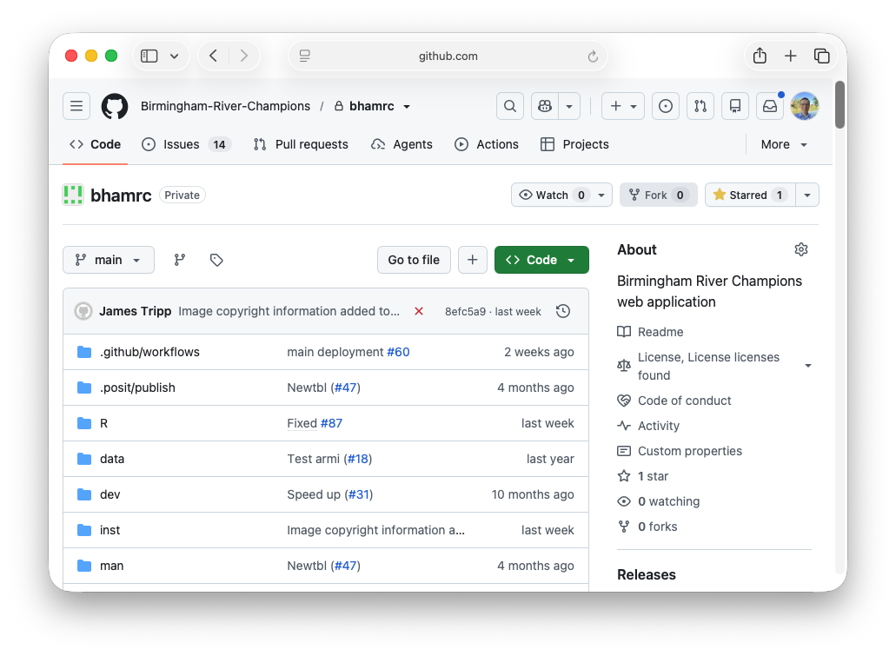
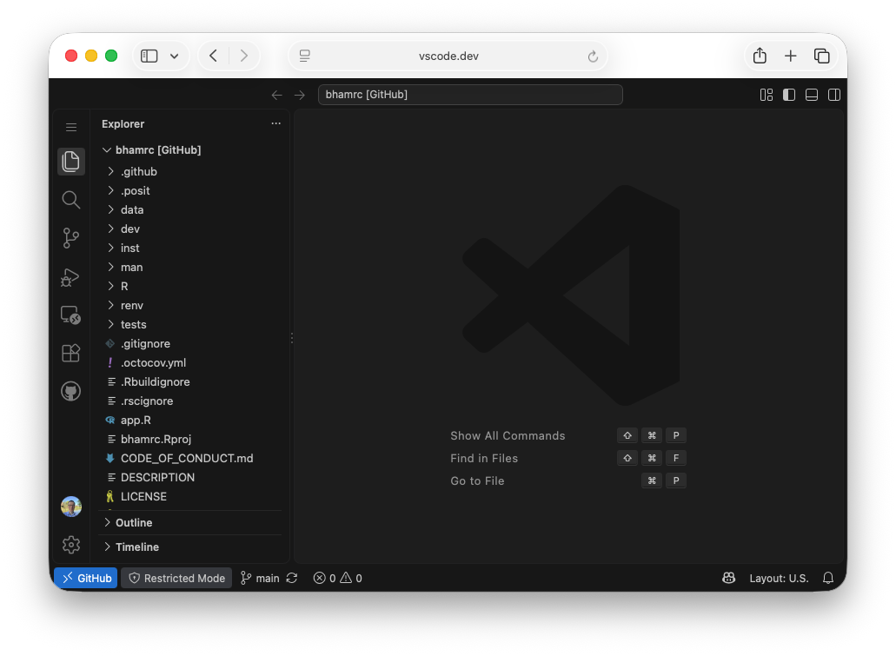
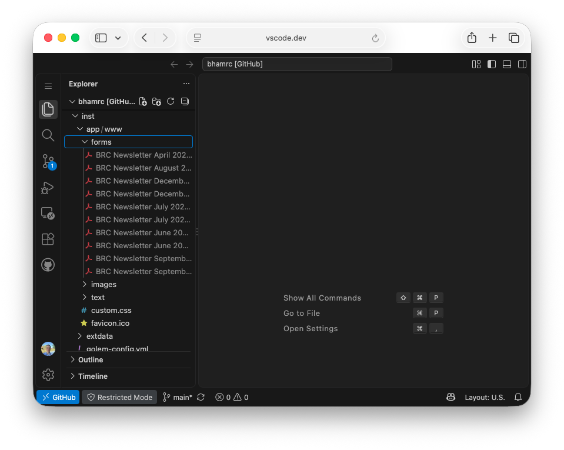
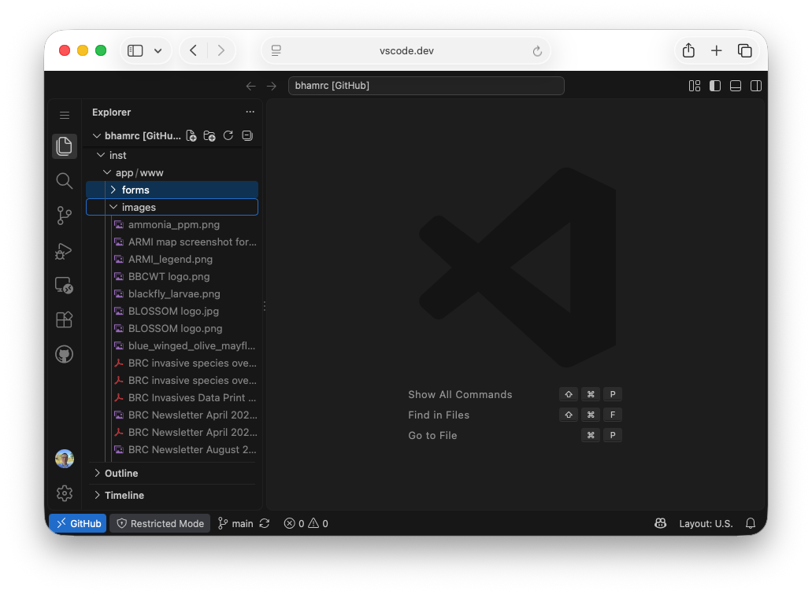
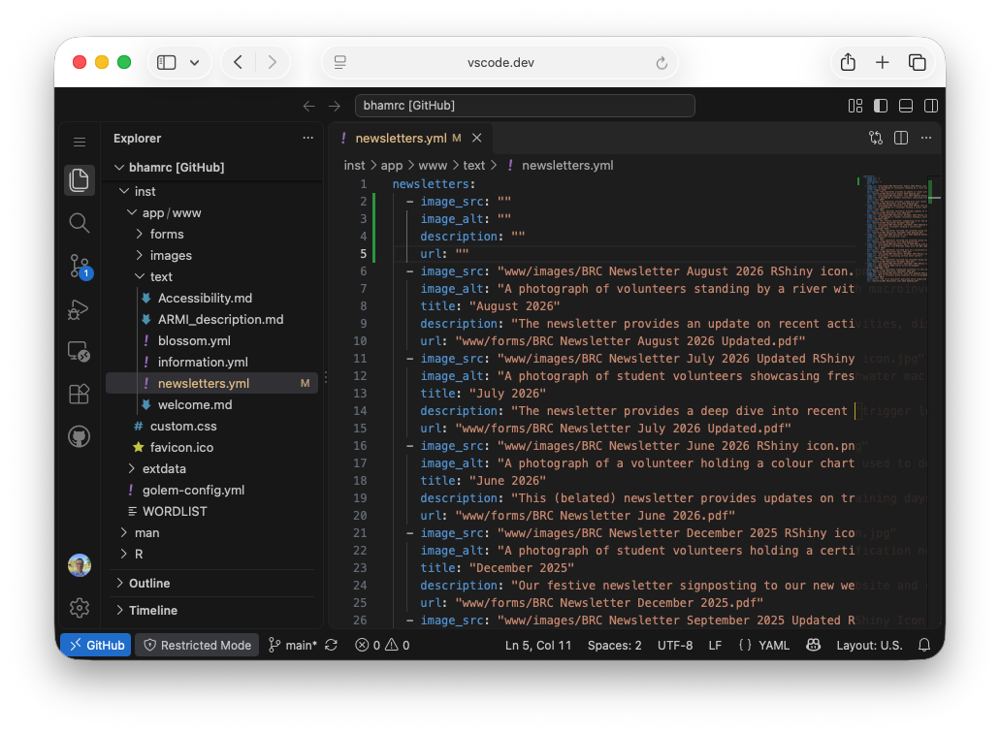
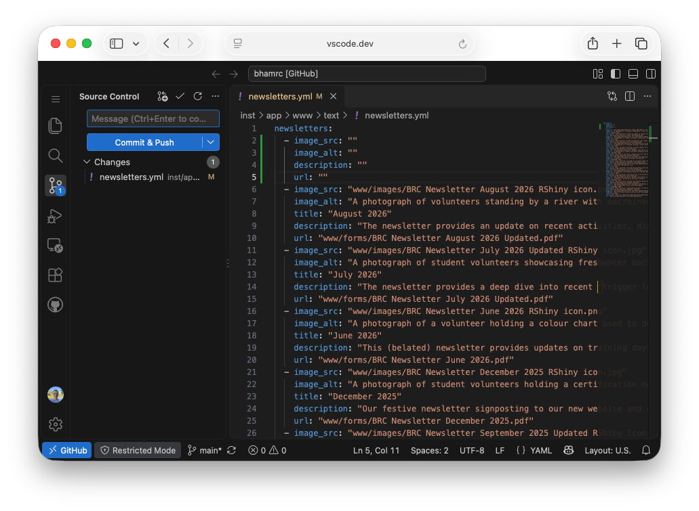

# Add Newsletter

You can add a new newsletter to this website using the online github editor. The instructions below will take you through the process.

1. Go to the [River Champions code repository](https://github.com/Birmingham-River-Champions/bhamrc) on Github. Make sure you are logged into your github account and that account has permissions to edit the code.

2. Press the period button to open the Github web editor. Click Allow if you are shown a message onscreen. You should see the GitHub web editor.

3. The pdf file for the new Newsletter should be placed in the inst/app/www/forms folder. Open up this folder in the GitHub web editor. Drag and drop the pdf into this folder.

4. The image for the pdf on the website should be placed in inst/app/www/images. Open up this folder in the GitHub web editor. Drag and drop the image file into this folder.

5. Open up the file int/app/www/text/newsletters.yml. This file contains the location of the pdf and image files for each newsletter, along with the title and description. The entry for each newsletter starts with a - and has the fields image_src, image_alt, description, url. Copy the lines for the last newsletter and paste these under the line containing the text newsletters:. **Note** The position of the image_src, image_alt, description and url text needs to be the same as the other entries.

6. Add the filepaths of the new files you have uploaded. For the newsletter image this should start www/images and for the pdf edit the url entry starting www/forms/.
7. Click on the source control tab. This is below the search tab button on the left hand side. The files you have added will be shown below the 'Commit & Push' button. Put your mouse over the filenames and click on the + button which appears. Each file will be moved from Changes into Staged Changes.

8. Enter a message in the Message box. This should describe what you are doing (e.g., Added October 2026 newsletter). Click the Commit & Push button. This will commit your updates to the code repository. 

![Github web editor - Ready to commit changes(Fig7.png)

There is an automated processes which builds the website and then deploys it onto shinyapp.io. This process can take up to 15 minutes. It is advisable to go to the website and make sure that the page has updated as expected.